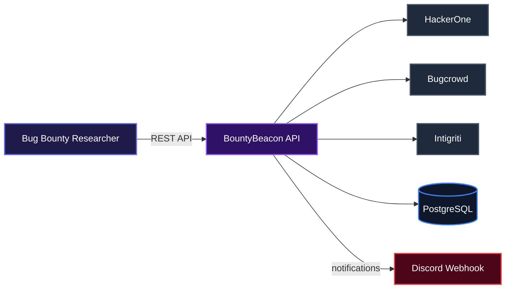
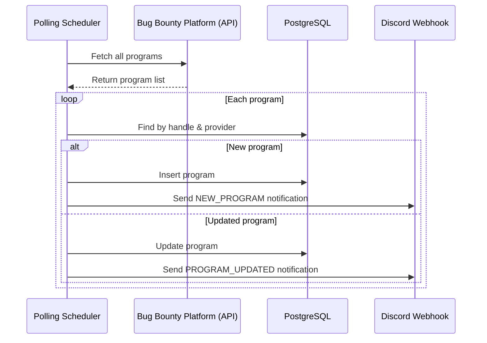

# BountyBeacon

A sleek bug bounty program aggregator that keeps security researchers in the loop. BountyBeacon pulls fresh program data from multiple platforms, stores it in one place, and fires real-time notifications to Discord whenever something new or updated appears.

## Overview

Security researchers spend too much time jumping between platforms just to track new bounty opportunities. BountyBeacon automates that entire process. It polls HackerOne, Bugcrowd, and Intigriti, keeps a local database of every program it finds, and pings your Discord server the moment a fresh target lands. No manual checking, no missed gigs.

## System Architecture



## Features

### Automated Program Discovery & Notification
BountyBeacon runs a configurable scheduler that queries each integrated platform, normalizes the results, and upserts them into a PostgreSQL database. Whenever a program appears for the first time or an existing one gets updated, it dispatches a rich Discord embed straight to your webhook.



### Multi-Platform Support
Works with HackerOne, Bugcrowd (via community aggregator), and Intigriti out of the box. Each platform is abstracted behind a `Provider` interface, so adding a new source is straightforward.

### REST API for Program Retrieval
A clean set of endpoints exposes the stored programs. You can browse paginated lists or fetch a single program by ID, perfect for building dashboards or integration tools.

### Configurable Polling Interval
Adjust how often BountyBeacon checks for updates by setting `app.polling.rate-ms` in the application config. The default is once per hour.

## Installation

**Prerequisites**  
- Docker and Docker Compose  
- API credentials for the platforms you want to poll (optional but recommended for higher rate limits)  
- A Discord webhook URL  

**Steps**

1. Clone the repository  
   ```bash
   git clone https://github.com/your-username/bounty-beacon.git
   cd bounty-beacon
   ```

2. Create a `.env` file with your secrets  
   ```env
   DISCORD_WEBHOOK_URL=https://discord.com/api/webhooks/...
   H1_USERNAME=your_h1_username
   H1_API_KEY=your_h1_api_key
   BC_API_KEY=your_bc_api_key
   INT_API_KEY=your_int_api_key
   ```

3. Start the stack  
   ```bash
   docker-compose up -d
   ```

The application will start on `http://localhost:8080`. A PostgreSQL database is also spun up and automatically migrated via Flyway.

## Usage

Once the containers are running, you can access the API.

List all programs (paginated):
```bash
curl http://localhost:8080/api/v1/programs?page=0&size=10
```

Get a single program by its ID:
```bash
curl http://localhost:8080/api/v1/programs/1
```

The scheduler begins polling immediately after startup using the default 1-hour interval. You’ll see notifications appear in the configured Discord channel as new programs are discovered.

## API Documentation

### GET /api/v1/programs
Retrieves a paginated list of all discovered programs.

**Query Parameters**  
- `page` (integer, default 0) – page index  
- `size` (integer, default 20) – number of items per page  

**Response**
```json
{
  "programs": [
    {
      "id": 1,
      "name": "Tesla",
      "handle": "tesla",
      "provider": "BUGCROWD",
      "description": "Bugcrowd Program: Tesla",
      "url": "https://bugcrowd.com/tesla",
      "logoUrl": null,
      "bounty": true,
      "createdAt": "2025-05-20T13:00:00",
      "updatedAt": "2025-05-20T13:00:00"
    }
  ],
  "total": 42
}
```

### GET /api/v1/programs/{id}
Fetches detailed information for a specific program.

**Path Parameters**  
- `id` (Long) – the program’s unique identifier  

**Response**  
Same `Program` object as above.

**Errors**  
- `404` – program not found  
- `500` – unexpected server error  

### Environment Variables

| Variable               | Required | Description                                      |
|------------------------|----------|--------------------------------------------------|
| `DB_HOST`              | No       | Database host (default: `localhost`)             |
| `DB_PORT`              | No       | Database port (default: `5432`)                  |
| `DB_NAME`              | No       | Database name (default: `bountybeacon`)           |
| `DB_USER`              | No       | Database user (default: `postgres`)               |
| `DB_PASSWORD`          | No       | Database password (default: `postgres`)           |
| `DISCORD_WEBHOOK_URL`  | Yes      | Full Discord webhook URL for notifications        |
| `H1_USERNAME`          | No       | HackerOne username for basic auth                 |
| `H1_API_KEY`           | No       | HackerOne API key                                 |
| `BC_API_KEY`           | No       | Bugcrowd API key (not actively used by aggregator)|
| `INT_API_KEY`          | No       | Intigriti API key for bearer auth                 |
| `app.polling.rate-ms`  | No       | Polling interval in milliseconds (default: 3600000)|

**Note:** While the Bugcrowd aggregator endpoint does not require authentication, the variable is defined for future use.

## Technologies Used

| Technology      | Purpose                          | Link                                       |
|-----------------|----------------------------------|--------------------------------------------|
| Java 25         | Core language                    | <https://openjdk.org/projects/jdk/25/>     |
| Spring Boot 3   | Application framework            | <https://spring.io/projects/spring-boot>   |
| PostgreSQL      | Persistent storage               | <https://www.postgresql.org/>              |
| Flyway          | Database migrations              | <https://flywaydb.org/>                    |
| WebClient (WebFlux) | Reactive HTTP calls          | <https://docs.spring.io/spring-framework/reference/web/webflux-webclient.html> |
| Discord Webhooks| Notification delivery            | <https://discord.com/developers/docs/resources/webhook> |
| Docker          | Containerisation                 | <https://www.docker.com/>                  |

## Contributing

Contributions are welcome. If you have ideas, open an issue or submit a pull request. Please follow the project’s coding style and include tests for new functionality.

## Author

Built with passion by Denzel Okungbowa.

- [LinkedIn](https://linkedin.com/in/denzel-okungbowa)
- [X (Twitter)](https://x.com/KiddMydas)

---

[](https://openjdk.org/projects/jdk/25/)
[](https://spring.io/projects/spring-boot)
[](https://www.postgresql.org/)
[](https://www.docker.com/)

[](https://dokugen.samueltuoyo.com)